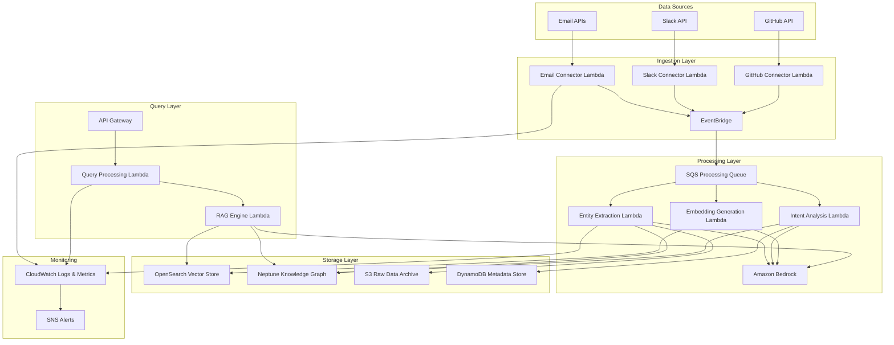
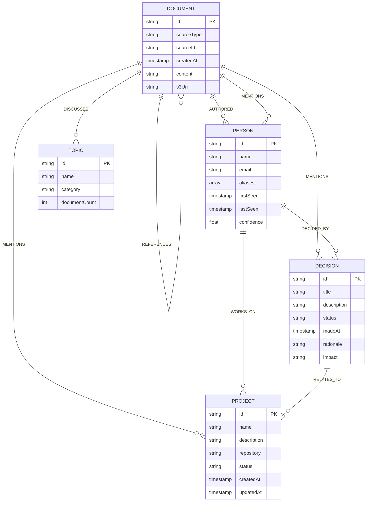

# Design Document: Memory Mapping System

## Overview

The Memory Mapping System is a serverless, event-driven architecture built on AWS that ingests data from multiple sources (Emails, Slack, GitHub), extracts entities and intent, constructs a hybrid Vector/Knowledge Graph memory using OpenSearch and Neptune, and provides a RAG-based query interface powered by Amazon Bedrock. The system ensures source traceability, data consistency, and scalable performance.

### Key Design Principles

- **Serverless-first**: Leverage AWS Lambda for compute to minimize operational overhead
- **Event-driven**: Use asynchronous processing for scalability and resilience
- **Hybrid memory**: Combine vector search (OpenSearch) with graph traversal (Neptune) for rich retrieval
- **Immutable audit trail**: Maintain complete provenance for compliance
- **Idempotent operations**: Ensure safe retries and exactly-once semantics

## Architecture

### System Architecture Diagram



### Architecture Flow

1. **Ingestion**: Connector Lambdas poll or receive webhooks from data sources
2. **Event Publishing**: Normalized events published to EventBridge
3. **Async Processing**: EventBridge routes to SQS for buffering and Lambda processing
4. **Extraction**: Entity and Intent Lambdas use Bedrock for NLP tasks
5. **Storage**: Embeddings stored in OpenSearch, entities/relationships in Neptune
6. **Query**: API Gateway receives queries, RAG Lambda orchestrates retrieval and generation
7. **Response**: Synthesized response with source citations returned to user

## Components and Interfaces

### 1. Ingestion Connectors

**Email Connector Lambda**
- **Purpose**: Poll email APIs (Gmail, Outlook) and normalize messages
- **Trigger**: EventBridge scheduled rule (every 60 seconds)
- **Input**: Email API credentials from Secrets Manager
- **Output**: Normalized document events to EventBridge
- **Error Handling**: Exponential backoff with DLQ for failed retrievals

**Slack Connector Lambda**
- **Purpose**: Receive Slack events via webhook and normalize messages
- **Trigger**: API Gateway webhook endpoint
- **Input**: Slack event payload
- **Output**: Normalized document events to EventBridge
- **Error Handling**: Idempotent processing using message IDs

**GitHub Connector Lambda**
- **Purpose**: Receive GitHub webhooks and normalize events
- **Trigger**: API Gateway webhook endpoint
- **Input**: GitHub webhook payload (commits, PRs, issues, comments)
- **Output**: Normalized document events to EventBridge
- **Error Handling**: Signature verification and idempotent processing

**Normalized Document Schema**:
```json
{
  "documentId": "string (UUID)",
  "sourceType": "email | slack | github",
  "sourceId": "string (original ID)",
  "timestamp": "ISO8601 timestamp",
  "author": {
    "id": "string",
    "name": "string",
    "email": "string"
  },
  "content": {
    "title": "string",
    "body": "string",
    "metadata": {}
  },
  "rawData": "S3 URI"
}
```

### 2. Processing Pipeline

**Entity Extraction Lambda**
- **Purpose**: Extract named entities using Bedrock
- **Trigger**: SQS message from ProcessQueue
- **Model**: Amazon Bedrock (Claude 3 or Titan)
- **Input**: Normalized document from SQS
- **Output**: 
  - Entities written to Neptune
  - Metadata written to DynamoDB
- **Processing**:
  1. Call Bedrock with entity extraction prompt
  2. Parse structured entity response
  3. Create/update Neptune nodes
  4. Create relationships between entities and documents
  5. Store confidence scores in DynamoDB

**Intent Analysis Lambda**
- **Purpose**: Classify intent and extract topics using Bedrock
- **Trigger**: SQS message from ProcessQueue
- **Model**: Amazon Bedrock (Claude 3 or Titan)
- **Input**: Normalized document from SQS
- **Output**:
  - Intent labels written to DynamoDB
  - Topic nodes created in Neptune
- **Processing**:
  1. Call Bedrock with intent classification prompt
  2. Extract intent categories and confidence scores
  3. Extract key topics and themes
  4. Create topic nodes in Neptune
  5. Link documents to topics

**Embedding Generation Lambda**
- **Purpose**: Generate vector embeddings for semantic search
- **Trigger**: SQS message from ProcessQueue
- **Model**: Amazon Bedrock (Titan Embeddings)
- **Input**: Normalized document from SQS
- **Output**: Vector embeddings written to OpenSearch
- **Processing**:
  1. Chunk document into passages (max 512 tokens)
  2. Generate embeddings via Bedrock Titan Embeddings
  3. Store vectors in OpenSearch with metadata
  4. Create cross-references to Neptune document nodes

### 3. Storage Layer

**OpenSearch Vector Store**
- **Index Schema**:
```json
{
  "mappings": {
    "properties": {
      "documentId": {"type": "keyword"},
      "chunkId": {"type": "keyword"},
      "embedding": {
        "type": "knn_vector",
        "dimension": 1536,
        "method": {
          "name": "hnsw",
          "engine": "nmslib"
        }
      },
      "content": {"type": "text"},
      "sourceType": {"type": "keyword"},
      "timestamp": {"type": "date"},
      "metadata": {"type": "object"}
    }
  }
}
```

**Neptune Knowledge Graph**
- **Node Types**:
  - **Document**: Represents ingested content
  - **Person**: Represents individuals
  - **Project**: Represents projects or repositories
  - **Decision**: Represents decisions or conclusions
  - **Topic**: Represents themes or subjects
  - **Organization**: Represents companies or teams

- **Person Node Schema**:
```json
{
  "id": "person:<uuid>",
  "type": "Person",
  "properties": {
    "name": "string",
    "email": "string",
    "aliases": ["string"],
    "firstSeen": "ISO8601 timestamp",
    "lastSeen": "ISO8601 timestamp",
    "confidence": "float (0.0-1.0)"
  }
}
```

- **Project Node Schema**:
```json
{
  "id": "project:<uuid>",
  "type": "Project",
  "properties": {
    "name": "string",
    "description": "string",
    "repository": "string (URL)",
    "status": "active | archived | planned",
    "createdAt": "ISO8601 timestamp",
    "updatedAt": "ISO8601 timestamp"
  }
}
```

- **Decision Node Schema**:
```json
{
  "id": "decision:<uuid>",
  "type": "Decision",
  "properties": {
    "title": "string",
    "description": "string",
    "status": "proposed | approved | rejected | implemented",
    "madeAt": "ISO8601 timestamp",
    "rationale": "string",
    "impact": "high | medium | low"
  }
}
```

- **Edge Types**:
  - **AUTHORED**: Person → Document
  - **MENTIONS**: Document → Person/Project/Decision
  - **WORKS_ON**: Person → Project
  - **DECIDED_BY**: Decision → Person
  - **RELATES_TO**: Decision → Project
  - **DISCUSSES**: Document → Topic
  - **REFERENCES**: Document → Document

**DynamoDB Metadata Store**
- **Table**: `memory-mapping-metadata`
- **Schema**:
```json
{
  "PK": "DOC#<documentId>",
  "SK": "METADATA",
  "documentId": "string",
  "sourceType": "string",
  "processingStatus": "pending | processing | completed | failed",
  "entityCount": "number",
  "intentLabels": ["string"],
  "intentConfidence": {"label": "float"},
  "embeddingStatus": "pending | completed | failed",
  "createdAt": "ISO8601 timestamp",
  "updatedAt": "ISO8601 timestamp",
  "ttl": "number (epoch seconds)"
}
```

**S3 Raw Data Archive**
- **Bucket**: `memory-mapping-raw-data`
- **Structure**: `s3://bucket/{sourceType}/{year}/{month}/{day}/{documentId}.json`
- **Lifecycle**: Transition to Glacier after 90 days

### 4. Query Interface

**API Gateway**
- **Endpoint**: `/query`
- **Method**: POST
- **Authentication**: AWS IAM or Cognito
- **Request Schema**:
```json
{
  "query": "string (natural language)",
  "filters": {
    "sourceTypes": ["email", "slack", "github"],
    "dateRange": {
      "start": "ISO8601 timestamp",
      "end": "ISO8601 timestamp"
    },
    "authors": ["string"]
  },
  "maxResults": "number (default: 5)"
}
```

**Query Processing Lambda**
- **Purpose**: Validate and route query requests
- **Input**: Query request from API Gateway
- **Output**: Validated query passed to RAG Lambda
- **Processing**:
  1. Validate query structure
  2. Check user authorization
  3. Apply access control filters
  4. Invoke RAG Lambda

**RAG Engine Lambda**
- **Purpose**: Orchestrate retrieval and generation
- **Input**: Validated query
- **Output**: Generated response with sources
- **Processing**:
  1. Generate query embedding via Bedrock
  2. Retrieve top-k vectors from OpenSearch (k=10)
  3. Extract document IDs from vector results
  4. Query Neptune for related entities within 2 hops
  5. Assemble context from vectors and graph
  6. Generate response via Bedrock with context
  7. Extract source citations
  8. Return response with provenance

**Response Schema**:
```json
{
  "answer": "string (generated response)",
  "sources": [
    {
      "documentId": "string",
      "sourceType": "string",
      "title": "string",
      "excerpt": "string",
      "relevanceScore": "float",
      "timestamp": "ISO8601 timestamp",
      "author": "string",
      "url": "string (if applicable)"
    }
  ],
  "entities": [
    {
      "type": "Person | Project | Decision",
      "name": "string",
      "relevance": "float"
    }
  ],
  "confidence": "float (0.0-1.0)"
}
```

### 5. Consistency and Transaction Management

**Two-Phase Write Pattern**
- **Phase 1**: Write to OpenSearch
- **Phase 2**: Write to Neptune
- **Rollback**: If Phase 2 fails, mark OpenSearch entry as invalid in DynamoDB
- **Reconciliation**: Background Lambda scans for inconsistencies and repairs

**Idempotency**
- All Lambdas use document ID as idempotency key
- DynamoDB conditional writes prevent duplicate processing
- SQS message deduplication enabled

## Data Models

### Entity Relationship Model



### Vector Embedding Model

- **Embedding Dimension**: 1536 (Bedrock Titan Embeddings)
- **Chunking Strategy**: Sliding window with 512 token chunks, 50 token overlap
- **Similarity Metric**: Cosine similarity
- **Index Type**: HNSW (Hierarchical Navigable Small World)

## Correctness Properties

*A property is a characteristic or behavior that should hold true across all valid executions of a system—essentially, a formal statement about what the system should do. Properties serve as the bridge between human-readable specifications and machine-verifiable correctness guarantees.*


### Property 1: Data Normalization Consistency
*For any* ingested document from any source (Email, Slack, GitHub), the normalized output SHALL conform to the standard document schema with all required fields (documentId, sourceType, sourceId, timestamp, author, content).
**Validates: Requirements 1.4**

### Property 2: Entity Confidence Bounds
*For any* extracted entity, the confidence score SHALL be a valid float between 0.0 and 1.0 inclusive.
**Validates: Requirements 2.2**

### Property 3: Entity Deduplication
*For any* pair of entities with similarity score >= 0.85, the system SHALL merge them into a single entity node in the Knowledge Graph.
**Validates: Requirements 2.3**

### Property 4: Entity Storage Completeness
*For any* extracted entity, the stored record SHALL contain all required fields: type, text, position, and source reference.
**Validates: Requirements 2.4**

### Property 5: Intent Classification Validity
*For any* analyzed content, the assigned intent label SHALL be one of the predefined categories: question, statement, request, notification, or discussion.
**Validates: Requirements 3.1**

### Property 6: Embedding Generation
*For any* processed document, the system SHALL generate at least one vector embedding and store it in OpenSearch.
**Validates: Requirements 4.1**

### Property 7: Entity-to-Graph Mapping
*For any* extracted entity, a corresponding node SHALL exist in the Neptune Knowledge Graph with matching entity ID.
**Validates: Requirements 4.2**

### Property 8: Relationship Edge Creation
*For any* detected relationship between entities, an edge SHALL exist in the Knowledge Graph with the appropriate relationship type.
**Validates: Requirements 4.3**

### Property 9: Embedding Metadata Completeness
*For any* vector embedding stored in OpenSearch, the record SHALL include metadata references (documentId, sourceType, timestamp).
**Validates: Requirements 4.4**

### Property 10: Atomic Dual-Store Updates
*For any* content update operation, both Vector_Store and Knowledge_Graph SHALL be updated successfully, or neither SHALL be modified (atomic transaction).
**Validates: Requirements 4.5, 7.1**

### Property 11: Bidirectional Store Linking
*For any* vector embedding in OpenSearch, there SHALL exist a corresponding document node in Neptune, and vice versa.
**Validates: Requirements 4.6**

### Property 12: Transaction Rollback Consistency
*For any* failed write operation to either Vector_Store or Knowledge_Graph, the system SHALL rollback changes to the other store, ensuring both stores remain consistent.
**Validates: Requirements 7.2, 7.3**

### Property 13: Dual-Store Deletion
*For any* document deletion operation, the document SHALL be removed from both Vector_Store and Knowledge_Graph.
**Validates: Requirements 7.4**

### Property 14: Query Embedding Generation
*For any* submitted user query, the RAG_Engine SHALL generate a query embedding before retrieval.
**Validates: Requirements 5.1**

### Property 15: Minimum Retrieval Results
*For any* query embedding, the RAG_Engine SHALL retrieve at least k similar vectors from Vector_Store (where k >= 5), when sufficient documents exist.
**Validates: Requirements 5.2**

### Property 16: Graph Traversal Hop Limit
*For any* retrieved vector, the RAG_Engine SHALL fetch related Knowledge_Graph nodes within exactly 2 hops, no more, no less.
**Validates: Requirements 5.3**

### Property 17: Response Generation Completeness
*For any* assembled context from retrieval, the RAG_Engine SHALL generate a non-empty response.
**Validates: Requirements 5.4**

### Property 18: Source Reference Inclusion
*For any* generated response, the output SHALL include at least one source reference with complete provenance information.
**Validates: Requirements 6.1**

### Property 19: Source Metadata Completeness
*For any* source reference in a response, it SHALL include all required fields: documentId, sourceType, timestamp, and author.
**Validates: Requirements 6.2**

### Property 20: Source Relevance Ranking
*For any* response with multiple source references, the sources SHALL be ordered by descending relevance score.
**Validates: Requirements 6.3**

### Property 21: Source Excerpt Retrieval
*For any* source reference, the system SHALL be able to retrieve and return the original content excerpt from S3.
**Validates: Requirements 6.4**

### Property 22: Immutable Audit Logging
*For any* data ingestion event, an immutable audit log entry SHALL be created and SHALL NOT be modifiable after creation.
**Validates: Requirements 6.5**

### Property 23: Authentication Requirement
*For any* unauthenticated request to the Query_Interface, the system SHALL reject the request with a 401 Unauthorized response.
**Validates: Requirements 8.1**

### Property 24: Authorization Verification
*For any* query submission, the system SHALL verify user authorization before processing the query.
**Validates: Requirements 8.2**

### Property 25: Unauthorized Access Denial and Logging
*For any* unauthorized access attempt, the system SHALL deny the request AND create a log entry with timestamp and user identifier.
**Validates: Requirements 8.3**

### Property 26: Expired Token Rejection
*For any* request with an expired authentication token, the system SHALL reject the request and require re-authentication.
**Validates: Requirements 8.5**

### Property 27: Isolated Source Failure
*For any* external API failure (Email, Slack, or GitHub), the system SHALL continue processing data from other available sources without interruption.
**Validates: Requirements 9.1**

### Property 28: Document Processing Isolation
*For any* document processing failure, the system SHALL log the error AND continue processing remaining documents in the queue.
**Validates: Requirements 9.2**

### Property 29: Store Unavailability Queueing
*For any* write operation when Vector_Store or Knowledge_Graph is unavailable, the system SHALL queue the write operation for retry when the service is restored.
**Validates: Requirements 9.3, 9.4**

### Property 30: Dead Letter Queue Population
*For any* processing attempt that fails after all retries, the system SHALL add the message to the dead letter queue.
**Validates: Requirements 9.5**

### Property 31: Critical Error Alerting
*For any* critical error event, the system SHALL send an alert notification to administrators via SNS.
**Validates: Requirements 9.6**

### Property 32: Storage Capacity Alerting
*For any* storage system (OpenSearch, Neptune, S3) reaching 80% capacity, the system SHALL trigger a capacity planning alert.
**Validates: Requirements 10.6**

### Property 33: Ingestion Error Logging
*For any* data ingestion failure, the system SHALL create a log entry containing timestamp, source information, and error details.
**Validates: Requirements 1.5**

### Property 34: Exponential Backoff Retry
*For any* connector unavailability, the system SHALL retry connection with exponential backoff, attempting up to 5 times before failing.
**Validates: Requirements 1.6**

## Error Handling

### Error Categories

1. **Transient Errors**: Network timeouts, rate limits, temporary service unavailability
   - **Strategy**: Exponential backoff with jitter, up to 5 retries
   - **Implementation**: AWS SDK built-in retry logic + custom retry decorators

2. **Permanent Errors**: Invalid credentials, malformed data, authorization failures
   - **Strategy**: Immediate failure, log error, send to DLQ
   - **Implementation**: Error classification in Lambda handlers

3. **Partial Failures**: Some documents succeed, others fail in batch processing
   - **Strategy**: Process successful items, retry failed items individually
   - **Implementation**: SQS batch processing with individual message handling

4. **Consistency Errors**: Vector/Graph store mismatch
   - **Strategy**: Rollback transaction, log inconsistency, trigger reconciliation
   - **Implementation**: Two-phase commit pattern with compensation logic

### Error Recovery Mechanisms

**Dead Letter Queue (DLQ)**
- All SQS queues have associated DLQs
- Messages move to DLQ after 5 failed processing attempts
- CloudWatch alarm triggers when DLQ depth > 10
- Manual review and reprocessing workflow

**Reconciliation Lambda**
- Runs every 24 hours via EventBridge schedule
- Scans DynamoDB for inconsistent states
- Queries OpenSearch and Neptune for orphaned records
- Repairs inconsistencies or flags for manual review
- Publishes metrics to CloudWatch

**Circuit Breaker Pattern**
- Implemented for external API calls (Email, Slack, GitHub)
- Opens after 5 consecutive failures
- Half-open state after 60 seconds
- Prevents cascading failures

### Monitoring and Alerting

**CloudWatch Metrics**
- Ingestion rate per source
- Processing latency (p50, p95, p99)
- Error rate by error type
- DLQ depth
- OpenSearch cluster health
- Neptune cluster health
- Lambda concurrent executions
- API Gateway 4xx/5xx rates

**CloudWatch Alarms**
- DLQ depth > 10 (Critical)
- Error rate > 5% (Warning)
- Processing latency p95 > 10s (Warning)
- OpenSearch cluster status != Green (Critical)
- Neptune cluster status != Available (Critical)
- Storage capacity > 80% (Warning)

**SNS Alert Topics**
- `memory-mapping-critical-alerts`: Paged to on-call
- `memory-mapping-warnings`: Email to team
- `memory-mapping-info`: Logged only

## Testing Strategy

### Dual Testing Approach

The testing strategy employs both unit tests and property-based tests to ensure comprehensive coverage:

- **Unit tests**: Verify specific examples, edge cases, and error conditions
- **Property tests**: Verify universal properties across all inputs using randomized test data

Both approaches are complementary and necessary. Unit tests catch concrete bugs with known inputs, while property tests verify general correctness across the input space.

### Property-Based Testing Configuration

**Library Selection**: 
- **Python**: Use `hypothesis` library for property-based testing
- **TypeScript/JavaScript**: Use `fast-check` library for property-based testing

**Test Configuration**:
- Each property test MUST run minimum 100 iterations to ensure adequate randomization coverage
- Each property test MUST include a comment tag referencing the design document property
- Tag format: `# Feature: memory-mapping, Property {number}: {property_text}`

**Example Property Test Structure** (Python with hypothesis):
```python
from hypothesis import given, strategies as st
import pytest

# Feature: memory-mapping, Property 2: Entity Confidence Bounds
@given(entity=st.builds(Entity, confidence=st.floats()))
def test_entity_confidence_bounds(entity):
    """For any extracted entity, confidence score must be between 0.0 and 1.0"""
    extracted = entity_extractor.extract(entity)
    assert 0.0 <= extracted.confidence <= 1.0
```

**Example Property Test Structure** (TypeScript with fast-check):
```typescript
import fc from 'fast-check';

// Feature: memory-mapping, Property 1: Data Normalization Consistency
test('normalized documents have all required fields', () => {
  fc.assert(
    fc.property(
      fc.record({
        sourceType: fc.constantFrom('email', 'slack', 'github'),
        content: fc.string(),
        author: fc.string()
      }),
      (rawDoc) => {
        const normalized = normalizeDocument(rawDoc);
        expect(normalized).toHaveProperty('documentId');
        expect(normalized).toHaveProperty('sourceType');
        expect(normalized).toHaveProperty('sourceId');
        expect(normalized).toHaveProperty('timestamp');
        expect(normalized).toHaveProperty('author');
        expect(normalized).toHaveProperty('content');
      }
    ),
    { numRuns: 100 }
  );
});
```

### Unit Testing Strategy

**Focus Areas**:
- Specific edge cases (empty strings, null values, boundary conditions)
- Error conditions (API failures, malformed data, timeout scenarios)
- Integration points (Lambda to SQS, Lambda to Bedrock, Lambda to Neptune)
- Authentication and authorization flows

**Avoid**:
- Writing too many unit tests for input variations (property tests handle this)
- Duplicating property test coverage with unit tests

### Integration Testing

**Component Integration Tests**:
- Test Lambda functions with LocalStack or AWS SAM Local
- Mock Bedrock API calls with recorded responses
- Use Neptune local or Docker container for graph tests
- Use OpenSearch Docker container for vector store tests

**End-to-End Tests**:
- Deploy to isolated test environment
- Ingest sample documents from each source
- Execute queries and verify responses
- Validate source traceability
- Check consistency between stores

### Performance Testing

**Load Testing**:
- Use Artillery or Locust for API Gateway load tests
- Simulate 100 concurrent users
- Measure p95 and p99 latency
- Verify auto-scaling behavior

**Capacity Testing**:
- Ingest 10,000 documents and measure processing time
- Verify OpenSearch can handle 1M+ embeddings
- Verify Neptune can handle 100K+ nodes

### Security Testing

**Authentication Tests**:
- Verify unauthenticated requests are rejected
- Verify expired tokens are rejected
- Verify role-based access control

**Authorization Tests**:
- Verify users can only access authorized data sources
- Verify cross-tenant data isolation

**Penetration Testing**:
- SQL/NoSQL injection attempts
- API rate limiting validation
- Secrets management verification

## Deployment Strategy

### Infrastructure as Code

**AWS CDK** (TypeScript):
- Define all infrastructure in CDK stacks
- Separate stacks for networking, storage, compute, and API
- Use CDK context for environment-specific configuration
- Implement custom constructs for reusable patterns

### CI/CD Pipeline

**GitHub Actions Workflow**:
1. **Build**: Compile TypeScript, package Lambda functions
2. **Test**: Run unit tests and property tests
3. **Security Scan**: Run Snyk or Trivy for vulnerability scanning
4. **Deploy to Dev**: CDK deploy to development environment
5. **Integration Tests**: Run integration test suite
6. **Deploy to Staging**: CDK deploy to staging environment
7. **E2E Tests**: Run end-to-end test suite
8. **Manual Approval**: Require approval for production
9. **Deploy to Production**: CDK deploy to production environment
10. **Smoke Tests**: Run critical path smoke tests

### Rollback Strategy

- Use CDK stack versioning for rollback
- Maintain previous Lambda versions with aliases
- Blue/green deployment for API Gateway stages
- Database migrations are forward-compatible only

## Security Considerations

### Data Encryption

- **At Rest**: 
  - S3 buckets use SSE-KMS encryption
  - OpenSearch uses encryption at rest
  - Neptune uses encryption at rest
  - DynamoDB uses encryption at rest
  
- **In Transit**:
  - All API calls use TLS 1.2+
  - VPC endpoints for AWS service communication
  - Lambda functions in VPC for Neptune/OpenSearch access

### Access Control

- **IAM Roles**: Least privilege principle for all Lambda functions
- **VPC Security Groups**: Restrict network access to storage layers
- **API Gateway**: AWS IAM or Cognito authentication
- **Secrets Manager**: Store API credentials and tokens

### Compliance

- **Audit Logging**: All access logged to CloudWatch Logs
- **Data Retention**: S3 lifecycle policies for GDPR compliance
- **PII Handling**: Entity extraction identifies and tags PII
- **Data Deletion**: Support for right-to-be-forgotten requests

## Scalability Considerations

### Horizontal Scaling

- **Lambda**: Auto-scales based on event volume
- **SQS**: Buffers spikes in ingestion load
- **OpenSearch**: Multi-node cluster with auto-scaling
- **Neptune**: Read replicas for query scaling

### Vertical Scaling

- **Lambda Memory**: Tune based on processing requirements
- **OpenSearch Instance Types**: Scale up for larger datasets
- **Neptune Instance Types**: Scale up for complex graph queries

### Cost Optimization

- **Lambda**: Use ARM64 Graviton2 for cost savings
- **S3**: Use Intelligent-Tiering for automatic cost optimization
- **OpenSearch**: Use UltraWarm for older data
- **Neptune**: Use T3/T4g instances for dev/test environments

## Future Enhancements

1. **Multi-modal Support**: Ingest images, videos, and audio
2. **Real-time Streaming**: Use Kinesis for sub-second latency
3. **Advanced Analytics**: Add trend detection and anomaly detection
4. **Collaborative Filtering**: Recommend relevant documents to users
5. **Graph Algorithms**: Implement PageRank, community detection
6. **Natural Language Generation**: Generate summaries and reports
7. **Multi-tenancy**: Support multiple organizations with data isolation
8. **Federated Search**: Query across multiple memory-mapping instances
